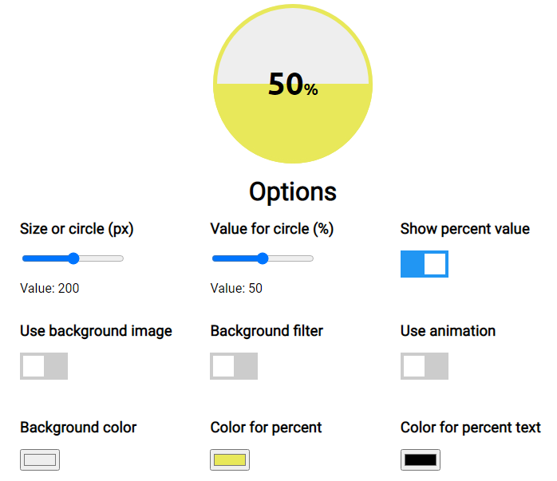

# Percentage Circle

This is a component that shows a circle filled according a percent value.

Their parameters are:

* **size**: diameter of the circle, in pixels (by default 200).
* **percentage**: percent value to use to fill the circle (from 0 to 100).
* **animate**: to indicate if the component must use an animation when is filling the circle.
* **showNumber**: to show or not the value in the center of the circle.
* **backgroundImage**: an url for an image to use as background of the circle.
* **backgroundFilter**: to indicate if it must to apply some filters to the background image (grayscale and blur).
* **percentColor**: color for the content that fills the circle with the percent.
* **backgroundColor**: a color to use as background of the circle (shown if any image isn't used).
* **percentTextColor**: color for the text of the percent value.

## Demo

Se puede ver una demostración del componente iniciando el servidor de desarrollo mediante el comando `ng serve`. Cuando el servidor esté inciado, navegar a `http://localhost:4200/`.

---

Componente que muestra un circulo que se llena con un valor porcentual.

Sus parámetros son:

* **size**: diámetro del círculo, en pixeles (por defecto 200).
* **percentage**: valor porcentual usado para llenar el circulo (de 0 a 100).
* **animate**: para indicar si el componente debe usar una animación al llenar el círculo..
* **showNumber**: si debe mostrar o no el valor porcentual en el centro del círculo.
* **backgroundImage**: una url de una imagen para usar como fondo del círculo.
* **backgroundFilter**: para indicar si debe usar o no filtros para la imagen de fondo (escala de grises y desenfoque).
* **percentColor**: color del contentido que rellena el círculo con el valor porcentual.
* **backgroundColor**: color para usar como fondo del círuclo. (se muestra si no se indica imagen de fondo).
* **percentTextColor**: color para el texto del valor porcentual.

